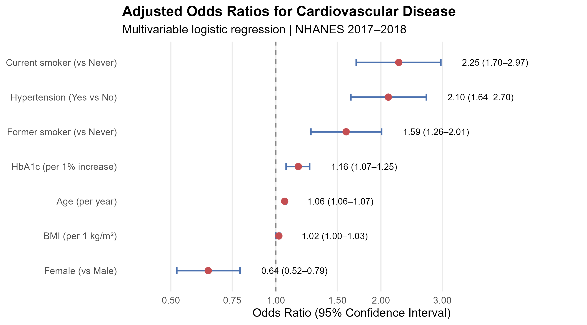
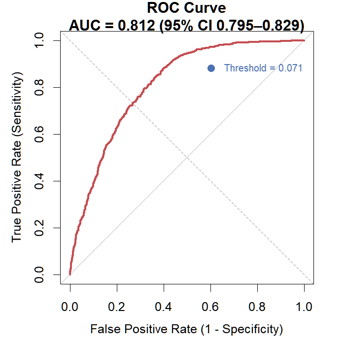
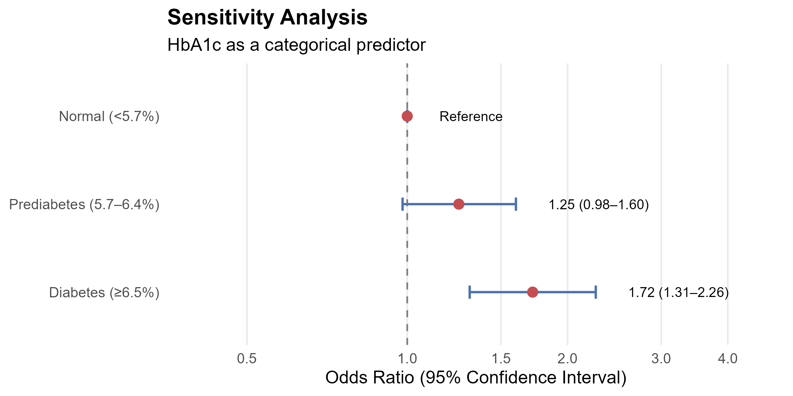

# NHANES HbA1c and Cardiovascular Disease

This repository demonstrates a fully reproducible biostatistical workflow implemented independently in R and SAS, from raw NHANES XPT files to publication-ready tables and figures.

## Project Overview

This project investigates the association between glycated hemoglobin
(HbA1c) and cardiovascular disease (CVD) using data from the National
Health and Nutrition Examination Survey (NHANES) 2017–2018.

The analysis was implemented independently in both **R** and **SAS** to
demonstrate reproducibility of statistical results across different
analytical environments. Every estimate below was cross-checked between
the two implementations — see
[Cross-Platform Validation](#cross-platform-validation) for the full
comparison.

---

## Objectives

- Explore the relationship between HbA1c and cardiovascular disease.
- Build multivariable logistic regression models adjusted for major
  cardiovascular risk factors.
- Compare continuous and categorical HbA1c models.
- Evaluate model discrimination using ROC analysis.
- Assess robustness using sensitivity analyses.
- Reproduce the complete workflow independently in both R and SAS, and
  validate that the two implementations converge on the same numbers.

---

## Dataset

**Source**

National Health and Nutrition Examination Survey (NHANES),  
Centers for Disease Control and Prevention (CDC)

https://wwwn.cdc.gov/nchs/nhanes/continuousnhanes/default.aspx?BeginYear=2017


Survey cycle: NHANES 2017–2018

Datasets used: `DEMO_J`, `GHB_J`, `BMX_J`, `BPQ_J`, `BPX_J`, `MCQ_J`, `SMQ_J`

**Outcome (CVD):** binary, coded *Yes* if the participant reported ever
being told by a doctor they had coronary heart disease, a heart attack,
or a stroke (`MCQ160C` / `MCQ160E` / `MCQ160F`). Self-reported, not
clinically adjudicated — see [Limitations](#limitations).

**Hypertension:** combined definition — self-report (`BPQ020`) **or**
measured mean systolic ≥140 mmHg or diastolic ≥90 mmHg (averaged over up
to 4 `BPX_J` readings). Either source alone is sufficient; a participant
is only excluded if both sources are missing.

**Smoking:** three categories — Never / Former / Current, derived from
`SMQ020` + `SMQ040`.

---

## Study Population

Adults aged 18 years or older with complete information on:

- HbA1c
- age
- sex
- race/ethnicity
- BMI
- smoking status
- hypertension
- cardiovascular disease


| Step | N |
|---|---|
| All participants, cycle 2017–2018 | 9,254 |
| Adults (age ≥ 18) | 5,856 |
| **Final analytic sample (complete cases)** | **4,919** |
| CVD prevalence | 492 / 4,919 = 10.0% |

---

## Statistical Analysis

### Exploratory Data Analysis
- descriptive statistics
- frequency tables
- histograms
- boxplots
- CVD prevalence by HbA1c category

### Inferential Statistics
- Chi-square tests (Fisher's exact when expected counts <5)
- Student's t-tests
- Logistic regression

Models:
1. Unadjusted model
2. Age- and sex-adjusted model
3. Fully adjusted model
4. HbA1c categorical model

Covariates: age, sex, BMI, smoking, hypertension

### Model Performance
- ROC curve, Area Under the Curve (AUC)
- Hosmer-Lemeshow goodness-of-fit test (SAS)

### Sensitivity Analyses
- HbA1c as categorical predictor
- Participants ≥40 years
- Never smokers
- Participants without hypertension

---

## Repository Structure

```
NHANES-HbA1c-CVD
│
├── R/
│   ├── 01_import.R
│   ├── 02_merge_clean.R
│   ├── 03_eda.R
│   ├── 04_table1.R
│   ├── 05_logistic_model.R
│   ├── 06_forest_plot.R
│   ├── 07_roc_curve.R
│   └── 08_sensitivity_analysis.R
│
├── SAS/
│   ├── 01_import.sas
│   ├── 02_prepare_data.sas
│   ├── 03_eda.sas
│   ├── 04_table1.sas
│   ├── 05_regression.sas
│   ├── 06_forest_plot.sas
│   ├── 07_roc_curve.sas
│   └── 08_sensitivity_analysis.sas
│
├── data/
├── figures/
├── output/
└── README.md
```


## How to Reproduce

**R:**
```r
setwd("path/to/NHANES-HbA1c-CVD")
source("R/01_import.R")
source("R/02_merge_clean.R")
source("R/03_eda.R")
source("R/04_table1.R")
source("R/05_logistic_model.R")
source("R/06_forest_plot.R")
source("R/07_roc_curve.R")
source("R/08_sensitivity_analysis.R")
```
Required packages: `haven`, `ggplot2`, `pROC`. Raw `.xpt` files must be
placed in `data/` first (download links above).

**SAS** (developed and validated on SAS OnDemand for Academics): run
`SAS/01_import.sas` through `SAS/08_sensitivity_analysis.sas` in order,
with raw `.xpt` files uploaded to the SAS server home directory
(`%let proj=/path/to/your/home;` at the top of each script).

---

## Main Results

### Multivariable logistic regression

`cvd ~ hba1c + age + sex + bmi + smoking + hypertension`

| Variable | OR | 95% CI | p-value |
|---|---|---|---|
| **HbA1c (per 1% increase)** | **1.16** | **1.07–1.25** | **<0.001** |
| Age (per year) | 1.06 | 1.06–1.07 | <0.001 |
| Sex: Female (vs Male) | 0.64 | 0.52–0.79 | <0.001 |
| BMI (per 1 kg/m²) | 1.02 | 1.00–1.03 | 0.032 |
| Smoking: Former (vs Never) | 1.59 | 1.26–2.01 | <0.001 |
| Smoking: Current (vs Never) | 2.25 | 1.70–2.97 | <0.001 |
| Hypertension: Yes (vs No) | 2.10 | 1.64–2.70 | <0.001 |

**Interpretation:** After adjustment for age, sex, BMI, smoking status,
and hypertension, each 1% increase in HbA1c was associated with
approximately 16% higher odds of cardiovascular disease.

McFadden's pseudo-R² = 0.186



**Elevated HbA1c is independently associated with CVD**, even after
adjusting for the major established cardiovascular risk factors.

### Model discrimination (ROC)

| Model | AUC | 95% CI |
|---|---|---|
| HbA1c only | 0.674 | — |
| Full adjusted model | **0.812** | 0.795–0.829 |



HbA1c alone is a weak discriminator (AUC=0.674); most of the model's
predictive power comes from age and the other established risk factors,
not from HbA1c itself. Hosmer-Lemeshow test (SAS): χ²=11.12, df=8,
**p=0.195** — no significant lack of calibration.

### Sensitivity analysis — HbA1c as clinical categories

Reference: HbA1c < 5.7% (Normal)

| HbA1c category | OR | 95% CI | p-value |
|---|---|---|---|
| 5.7–6.4% (Prediabetes) | 1.25 | 0.98–1.60 | 0.067 |
| ≥6.5% (Diabetes) | 1.72 | 1.31–2.26 | <0.001 |



The association is **not a smooth linear gradient**: it is concentrated
in the diabetic range. Prediabetes shows a similar point estimate but
does not reach statistical significance in this sample — likely an
underpowered subgroup rather than evidence of no effect.

---

## Cross-Platform Validation

Every table above was computed independently in R and in SAS
(`PROC LOGISTIC`, `PROC MEANS`, `PROC FREQ`) on the same analytic
sample, then compared number by number — not just "both languages ran
without errors," but checked to the second or third decimal place:

| Metric | R | SAS | Match |
|---|---|---|---|
| N (complete-case) | 4,919 | 4,919 | ✅ |
| CVD Yes / No | 492 / 4,427 | 492 / 4,427 | ✅ |
| HbA1c OR (continuous) | 1.16 [1.07–1.25] | 1.162 [1.076–1.254] | ✅ |
| Age OR | 1.06 | 1.065 | ✅ |
| Sex OR (Female vs Male) | 0.64 [0.52–0.79] | 0.644 [0.522–0.795] | ✅ |
| Hypertension OR | 2.10 | 2.098 | ✅ |
| AUC, full model | 0.812 [0.795–0.829] | 0.8118 [0.795–0.829] | ✅ |
| AUC, HbA1c only | 0.674 | 0.6736 | ✅ |
| Diabetes OR (categorical) | 1.72 [1.31–2.26] | 1.720 [1.312–2.256] | ✅ |
| Prediabetes OR (categorical) | 1.25 [0.98–1.60], p=0.067 | 1.253 [0.984–1.595], p=0.067 | ✅ |

Getting an exact match required correcting several definitional
mismatches between the two implementations during development:

- **Missing-value handling in comparisons.** SAS treats a missing
  numeric as smaller than any real number, so `if hba1c < 5.7` without
  an explicit `missing()` check silently classified missing HbA1c as
  "Normal."
- **AND vs. OR logic for multi-source variables.** The combined outcome
  definitions (CVD from three diagnosis variables, hypertension from
  self-report + measured BP) used AND-logic in one draft and OR-logic
  in the other when handling partial missingness — same intent,
  opposite behavior whenever only some of the source variables were
  available.
- **Factor reference levels.** R's factor reference (the first level)
  didn't automatically match the SAS `class ... (ref=...)` value —
  getting this backwards silently flips an odds ratio into its own
  reciprocal, with no error thrown.

None of these produced a warning or an error in either language — they
were only caught by checking two independent implementations against
each other line by line and refusing to accept "close enough."

---

## Limitations

- **Cross-sectional design** — associations only, no causal inference.
  Elevated HbA1c could partly reflect stress hyperglycemia following a
  cardiovascular event rather than preceding it.
- **Self-reported CVD outcome** — based on participant recall of
  physician diagnosis, not clinically adjudicated; subject to recall
  bias and underdiagnosis.
- **Possible reverse causation in smoking** — the CVD group has a
  disproportionately high share of former smokers (40.9% vs 22.2%),
  consistent with a "healthy quitter" effect (quitting after a
  cardiovascular event) rather than cessation reducing risk beforehand.
- **Residual confounding** — family history, lipid profile, physical
  activity, and medication use (statins, antihypertensives) are not
  available in this variable set.
- **Complete-case analysis** — 937 adults (16%) were excluded due to
  missing HbA1c, BMI, or outcome data; no multiple imputation was
  performed.

---

## Software

### R

R 4.5

haven

dplyr

ggplot2

pROC

### SAS

SAS OnDemand for Academics

PROC SQL

PROC LOGISTIC

PROC FREQ

PROC MEANS

PROC SGPLOT


---

## Author

**Nadezhda Shilina**
LinkedIn: https://www.linkedin.com/in/nadya-shilina
